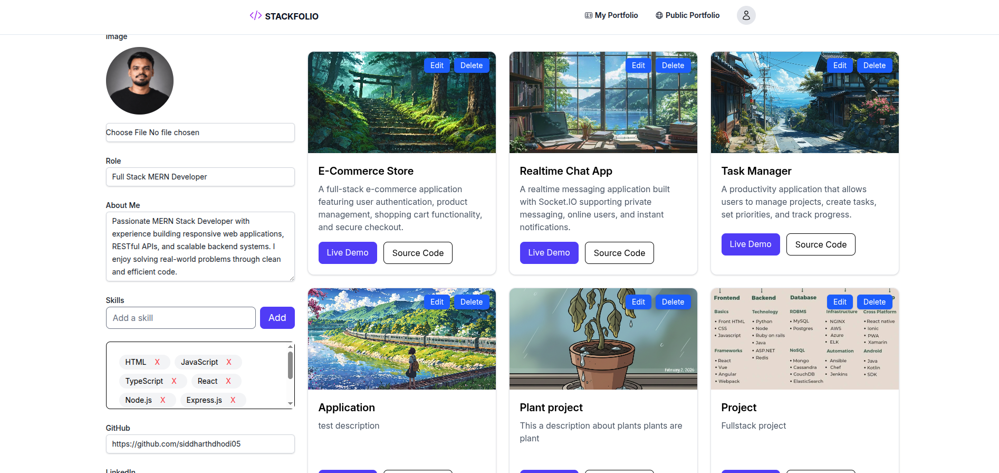
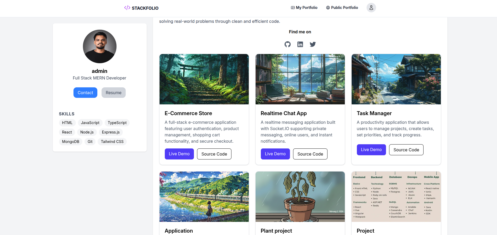
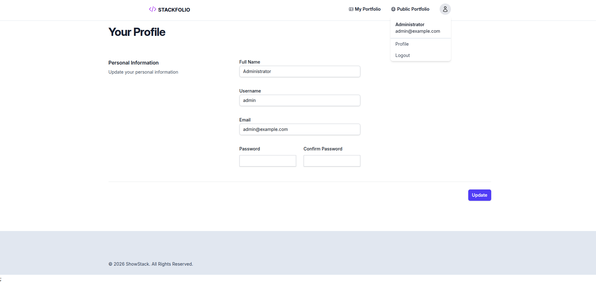
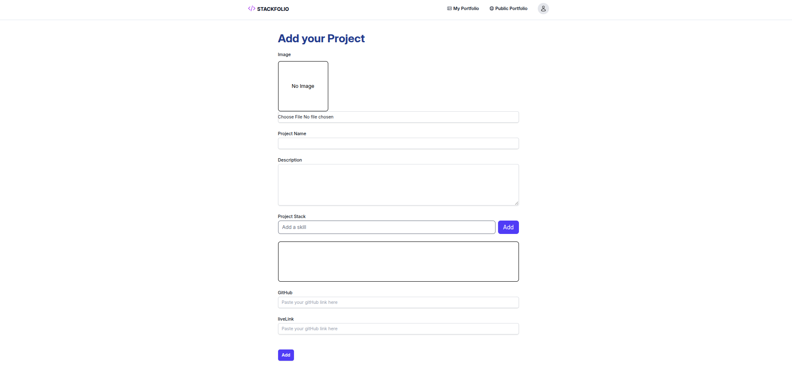

# ShowStack

ShowStack is a full-stack portfolio management application that allows users to create, manage, and publicly showcase their professional profiles and projects.

The application includes JWT authentication, ownership-based authorization, project management, image uploads, and a public portfolio view.

## Tech Stack

**Frontend**

* React.js
* Redux Toolkit
* RTK Query

**Backend**

* Node.js
* Express.js
* MongoDB
* JWT
* Multer
* Cloudinary

## Features

* JWT-based authentication
* Profile management
* Create and update portfolio projects
* Public portfolio pages
* Resource ownership-based authorization
* Image uploads with Multer and Cloudinary
* 15+ RESTful API endpoints
* 3 MongoDB schemas
* Reusable React components and custom hooks
* API caching and server-state management with RTK Query
* Centralized error handling
* Protected backend routes

## Screenshots

### My Portfolio



### Public Portfolio



### Profile



### Add Project




## Architecture

The application is divided into a React frontend and an Express.js backend.

```text
Client
React.js
    |
    v
Redux Toolkit + RTK Query
    |
    | REST API
    v
Server
Express.js + Node.js
    |
    +--> Authentication / Authorization
    |
    +--> Controllers / Routes
    |
    +--> MongoDB
    |
    +--> Cloudinary
```

The backend follows a modular structure separating routes, controllers, middleware, and data models.

## Authentication and Authorization

Authentication is implemented using JWT-protected routes.

In addition to authentication, the backend performs resource ownership checks. Users can only modify resources belonging to their own account, preventing unauthorized access even when another resource ID is known.

Reusable middleware is used for:

* Authentication
* Error handling
* File uploads

## Image Uploads

Project images are uploaded using Multer and stored using Cloudinary.

```text
React Client
     |
     v
Multipart Upload
     |
     v
Multer
     |
     v
Express API
     |
     v
Cloudinary
     |
     v
Stored Image URL
```

The application supports multipart image uploads up to 10 MB.

## State Management

Redux Toolkit is used for client-side state management, while RTK Query handles communication with the backend API.

RTK Query provides API caching, request management, loading states, error states, and cache invalidation without requiring repetitive API-handling logic across components.

## Project Structure

```text
showStack/
├── client/
├── server/
├── screenshots/
│   ├── profile.png
│   ├── addProject.png
│   ├── myPortfolio.png
│   ├── publicportfolio.png
│   ├── Screenshot From 2026-09-21 17-55-54.png
│   ├── Screenshot From 2026-09-21 18-32-11.png
│   ├── Screenshot From 2026-09-21 18-39-41.png
│   ├── Screenshot From 2026-09-27 21-23-57.png
│   └── datesss.png
├── jsconfig.json
├── package.json
└── package-lock.json
```

## Getting Started

### Prerequisites

* Node.js
* MongoDB
* Cloudinary account

### Installation

Clone the repository:

```bash
git clone <repository-url>
cd showStack
```

Install client dependencies:

```bash
cd client
npm install
```

Install server dependencies:

```bash
cd ../server
npm install
```

### Environment Variables

Create a `.env` file in the server directory:

```env
PORT=5000
MONGO_URI=your_mongodb_connection_string
JWT_SECRET=your_jwt_secret

CLOUDINARY_CLOUD_NAME=your_cloudinary_cloud_name
CLOUDINARY_API_KEY=your_cloudinary_api_key
CLOUDINARY_API_SECRET=your_cloudinary_api_secret
```

Do not commit environment variables or credentials to the repository.

### Running the Application

Start the backend:

```bash
cd server
npm run dev
```

Start the frontend in a separate terminal:

```bash
cd client
npm run dev
```

## Project Highlights

* Developed 15+ RESTful API endpoints
* Designed 3 MongoDB schemas
* Built 15+ reusable React components and custom hooks
* Implemented JWT authentication and resource ownership authorization
* Integrated Redux Toolkit and RTK Query for state management and API caching
* Implemented reusable authentication, error-handling, and upload middleware
* Integrated Multer and Cloudinary for image management with 10 MB upload support
* Built authenticated portfolio management and a public portfolio experience
